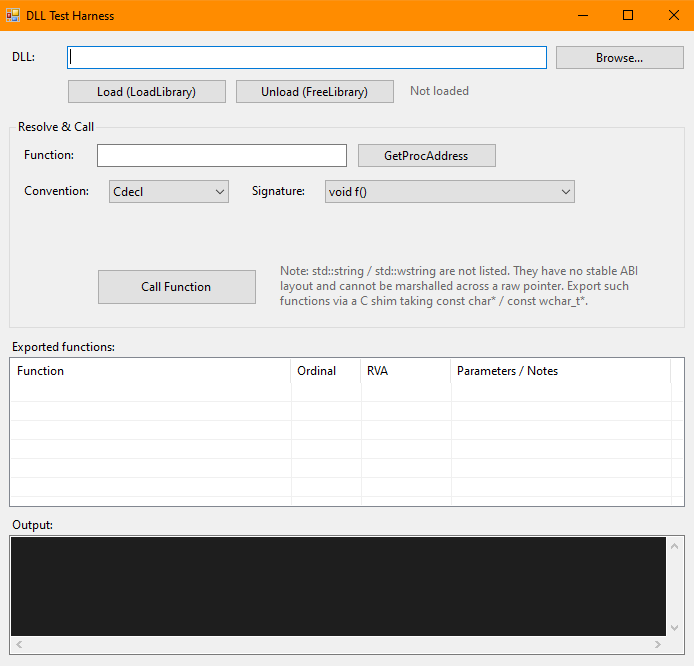

# DLL Test Harness

A small Windows Forms tool for loading a native DLL, inspecting its exported functions, and calling them by hand — without writing a line of C# per DLL. Built for poking at C/C++ DLLs during development and reverse-engineering work.

It does three things:

- **Loads** a DLL with `LoadLibrary` and reports the module handle (or the exact Win32 error if it fails).
- **Lists every export** by parsing the PE export table directly off disk — name, ordinal, RVA, and a best-effort parameter hint — with no dependency on `dumpbin` or DbgHelp.
- **Calls** any export through `GetProcAddress` + a marshalled function pointer, picking the calling convention and one of 20 supported signatures from a dropdown.

## Screenshot



## Requirements

- Windows
- .NET Framework 4.8
- Visual Studio 2019 or newer (the project is the classic, non-SDK `.csproj` format)

## Building

Open `DllTestHarness.sln` in Visual Studio, pick a platform, and build.

**Match the bitness to the DLLs you intend to test.** A 64-bit process can only load 64-bit DLLs and vice versa — this is a hard Windows rule, not a limitation of the tool. The solution ships with both **x64** (default) and **x86** configurations; flip the platform dropdown in the toolbar. If you load a DLL of the wrong architecture, `LoadLibrary` fails with error 193 (`ERROR_BAD_EXE_FORMAT`) and the tool says so.

## Usage

1. **Browse** to a DLL (or paste its path) and click **Load**. The export list fills immediately.
2. Click any row in the export list to drop its name into the call box.
3. Pick the **calling convention** and **signature** that match the function.
4. Enter arguments if the signature takes any, then click **Call Function**. The return value (or any error) is logged.

`GetProcAddress` button resolves a name to its address without calling it, if you just want to check a symbol exists.

### Calling conventions

The dropdown offers **Cdecl** and **StdCall**.

- On **x64** this doesn't matter — there's a single unified convention, so either choice behaves identically.
- On **x86** it matters: `__cdecl` is the C/C++ default, `__stdcall` is the Win32-API style. Picking the wrong one corrupts the stack. Note that x86 `__stdcall` exports are also name-decorated as `_Func@N`.

### Supported signatures

| Returns | Example |
|---|---|
| `void` | `void f()` |
| `int` | `int f()`, `int f(int)`, `int f(int, int)` |
| `long long` | `long long f(long long, long long)` |
| `unsigned int` | `unsigned int f()` |
| `double` | `double f()`, `double f(double, double)` |
| `float` | `float f(float)` |
| `char*` (ANSI) | `const char* f()`, `int f(const char*)`, `const char* f(const char*)` |
| `wchar_t*` (UTF-16) | `const wchar_t* f()`, `int f(const wchar_t*)`, `const wchar_t* f(const wchar_t*)`, `int f(const wchar_t*, int)` |
| `BSTR` | `BSTR f()` |
| pointer / handle | `void* f()`, `int f(void*)` |
| `bool` | `bool f(bool)` (marshalled as Win32 `BOOL`) |

Argument inputs accept hex (`0x…`) or decimal for integers, plain decimals for floats/doubles, and `true`/`false` or `1`/`0` for booleans.

### A note on the parameter hints

A plain DLL's export table stores only **names and addresses** — not parameter types. So the "Parameters / Notes" column is best-effort:

- **x86 `__stdcall` / `__fastcall`**: the decorated name encodes the argument byte count (`_Func@8` → ~2 32-bit params), which the tool decodes.
- **x86 `__cdecl` and all x64**: no per-export type info exists in the binary, so the column says as much.
- **C++ mangled names** (`?Foo@@…`): flagged as needing demangling for the full signature.

Full parameter *types* would require debug symbols (a `.pdb`). That's not currently implemented.

### Why `std::string` / `std::wstring` aren't supported

They're deliberately absent from the signature list. `std::string` and `std::wstring` are **not ABI types** — they're C++ template classes whose memory layout (the small-string-optimization buffer, capacity field, allocator) varies by compiler, by STL version, and even between debug and release CRTs. There is no stable layout to marshal across a raw function pointer, so faking one would silently corrupt the heap the moment the DLL was built with a different toolchain.

The standard fix is to not export STL types in the first place: wrap the function in a C shim taking `const char*` / `const wchar_t*` — both of which this tool handles fully.

```cpp
// Instead of exporting this:
//   __declspec(dllexport) std::wstring Process(std::wstring in);
// export a C-ABI shim:
extern "C" __declspec(dllexport)
int Process(const wchar_t* in, wchar_t* out, int outLen);
```

## Getting your C/C++ exports to resolve

`GetProcAddress` needs the **exact exported name**. C++ mangles names by default, so either:

```cpp
extern "C" __declspec(dllexport) int MyFunc(int a) { return a * 2; }
```

…or look up the mangled name with `dumpbin /exports yourdll.dll` and paste it verbatim. The export list in the tool also shows you the real exported names directly.

## ⚠️ Safety

**Loading a DLL runs its code.** `DllMain` executes the instant `LoadLibrary` succeeds — before you call any function. Only load DLLs you trust or are deliberately analysing in an environment you're prepared to lose. Treat unknown DLLs the way you'd treat any untrusted executable.

Separately, calling a native function with the **wrong signature or calling convention** can corrupt the stack or trigger an access violation that takes down the whole process. The tool catches managed exceptions, but a true access violation inside the DLL isn't something managed code can fully contain. Match the signature and convention and you're fine.

## How it works

- `LoadLibrary` / `GetProcAddress` / `FreeLibrary` are P/Invoked from `kernel32.dll`.
- Each function pointer is turned into a callable delegate via `Marshal.GetDelegateForFunctionPointer`, using `[UnmanagedFunctionPointer]` delegates with the right `[MarshalAs]` attributes per type.
- The export reader (`PeExportReader.cs`) walks the PE headers by hand: DOS header → PE signature → optional header (PE32 vs PE32+) → data directory 0 → export directory, translating RVAs to file offsets via the section table. It also resolves forwarder exports.

## Project layout

```
DllTestHarness/
├── DllTestHarness.sln
├── DllTestHarness.csproj
├── MainForm.cs              # logic: load/call/list, marshalling, parsing
├── MainForm.Designer.cs     # WinForms designer layout (editable in VS)
├── PeExportReader.cs        # standalone PE export-table parser
├── Program.cs               # entry point
├── App.config
└── Properties/
    └── AssemblyInfo.cs
```

`MainForm` is split into the standard partial-class pattern, so the WinForms designer opens and edits it normally.

